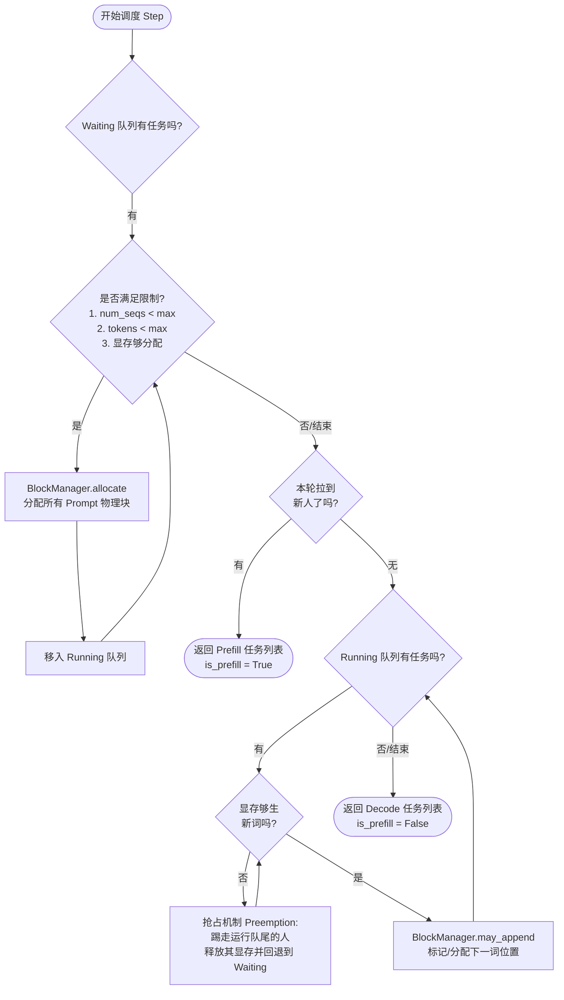

>项目连接: [nano-vllm](https://github.com/GeeeekExplorer/nano-vllm)
>参考文章：[2025最快下手vLLM的项目-nanovllm源码解读](https://zhuanlan.zhihu.com/p/1925484783229698084)

# 项目结构
```
nanovllm/
├── engine/                    #   推理引擎核心
│   ├── llm_engine.py         #   └── 总协调器，驱动整个推理流程
│   ├── scheduler.py          #   └── 智能调度器，决定执行顺序
│   ├── block_manager.py      #   └── KV缓存内存管理 (PagedAttention核心)
│   ├── model_runner.py       #   └── 单GPU上的模型执行器
│   └── sequence.py           #   └── 请求序列的数据结构
├── layers/                    # ⚙️ 神经网络层实现
│   ├── attention.py          #   └── FlashAttention + KV缓存管理
│   ├── sampler.py            #   └── 从logits采样生成token
│   ├── linear.py             #   └── 支持张量并行的线性层
│   ├── layernorm.py          #   └── RMS LayerNorm
│   ├── rotary_embedding.py   #   └── 旋转位置编码 (RoPE)
│   ├── activation.py         #   └── 激活函数 (SiLU)
│   └── embed_head.py         #   └── 词嵌入和语言模型头
├── models/                    #  ️ 具体模型架构
│   └── qwen3.py              #   └── Qwen3模型完整实现
├── utils/                     #   工具模块
│   ├── context.py            #   └── 全局上下文状态管理
│   └── loader.py             #   └── 模型权重加载器
├── config.py                 # ⚙️ 配置管理
├── llm.py                   #   用户接口入口
└── sampling_params.py       #   采样参数定义
```

# 整体架构图
```text
                          用户接口层
                        ┌─────────┐
                        │   LLM   │
                        └────┬────┘
                             │
                             ▼
                    ┌─────────────────┐
                    │   LLMEngine     │  ← 总指挥官
                    │                 │
                    │ ┌─────────────┐ │
                    │ │ Scheduler   │ │  ← 调度器
                    │ │ BlockManager│ │  ← 内存管家  
                    │ │ ModelRunner │ │  ← 执行引擎
                    │ └─────────────┘ │
                    └────────┬────────┘
                             │
                             ▼
                    ┌─────────────────┐
                    │ Model + Layers  │
                    │                 │
                    │ Qwen3Model      │  ← 模型主体
                    │ Attention       │  ← 注意力层
                    │ Sampler         │  ← 采样器
                    └─────────────────┘
```

# 关键数据流
## 数据流图
```text
用户输入 → Tokenizer → Sequence → Scheduler → ModelRunner → Model → Sampler → 输出

详细展开：
prompts     token_ids    Sequence     scheduled    input_ids    logits   token_ids    decoded_text
  ↓            ↓           ↓           seqs          ↓           ↓          ↓            ↓
"Hello"  →  [123,45]  →  Seq#1    →  [Seq#1]   →  tensor   →  tensor  →    67      →  " world"
"Hi"     →  [89,12]   →  Seq#2    →  [Seq#2]   →  [...]    →  [...]   →    23      →  " there"
```

## 数据结构转换过程
```text
# 1. 用户输入转换为Sequence对象
prompts = ["Hello", "How are you?"]
sampling_params = SamplingParams(temperature=0.8, max_tokens=50)

# 2. 每个prompt变成一个Sequence
sequences = []
for prompt in prompts:
    token_ids = tokenizer.encode(prompt)  # "Hello" → [123, 45, 67]
    seq = Sequence(token_ids, sampling_params)
    sequences.append(seq)

# 3. Scheduler决定哪些序列一起执行
scheduled_seqs, is_prefill = scheduler.schedule()
# 可能返回: ([seq1, seq2], True)  表示批量处理2个序列的prefill

# 4. ModelRunner准备模型输入
if is_prefill:
    input_ids, positions = prepare_prefill(scheduled_seqs)
    # input_ids: [123, 45, 67, 89, 12, 34]  # 拼接所有序列
    # positions: [0, 1, 2, 0, 1, 2]        # 每个token在序列中的位置
else:
    input_ids, positions = prepare_decode(scheduled_seqs)
    # input_ids: [67, 34]                   # 每个序列的最后一个token
    # positions: [3, 3]                    # 下一个位置（这里是为了指向计算出的新kv存储的位置，所以对于decode来说是下一个位置）

# 5. 模型计算得到logits
logits = model(input_ids, positions)
# logits shape: [batch_size, vocab_size]

# 6. Sampler生成下一个token
next_tokens = sampler(logits, temperatures)
# next_tokens: [89, 56]  # 为每个序列生成下一个token
```

# vLLM 工作流程

>以 bench.py 为例

### 初始化
-> `LLM()`  初始化一个 LLM 对象：
- 加载 config 配置
- 创建多个 `ModelRunner` 进程实现多线程（避免 Python 的GIL全局解释锁）
- 创建 `Scheduler` 管理器对象

具体而言
```python
def __init__(self, model, **kwargs):
	config_fields = {field.name for field in fields(Config)}
	config_kwargs = {k: v for k, v in kwargs.items() if k in config_fields}
	config = Config(model, **config_kwargs)
	self.ps = []
	self.events = []
	# CUDA 强制要求 -> spawn 启动方法会创建完全干净的新py解释器，确保每个进程能够独立、安全初始化CUDA环境
	ctx = mp.get_context("spawn")
	for i in range(1, config.tensor_parallel_size):
		event = ctx.Event() # 子进程同步事件对象
		process = ctx.Process(target=ModelRunner, args=(config, i, event)) # 创建子进程，target是进程启动后的类或函数
		process.start() # 启动子进程
		self.ps.append(process) # 方便后续的进程管理
		self.events.append(event) # 用于主进程和子进程间的通信
	self.model_runner = ModelRunner(config, 0, self.events)
	self.tokenizer = AutoTokenizer.from_pretrained(config.model, use_fast=True)
	config.eos = self.tokenizer.eos_token_id
	self.scheduler = Scheduler(config)
	atexit.register(self.exit)
```

关于 torch.multiprocessing 可以参考文章：[torch.multiprocessing](https://blog.csdn.net/weixin_42764932/article/details/132090185)

#### ModelRunner
```python
def __init__(self, config: Config, rank: int, event: Event | list[Event]):
	self.config = config
	hf_config = config.hf_config
	self.block_size = config.kvcache_block_size
	self.enforce_eager = config.enforce_eager
	self.world_size = config.tensor_parallel_size
	self.rank = rank
	self.event = event
	
	dist.init_process_group("nccl", "tcp://localhost:2333", world_size=self.world_size, rank=rank) # 分布式训练组
	torch.cuda.set_device(rank)
	default_dtype = torch.get_default_dtype()
	torch.set_default_dtype(hf_config.torch_dtype)
	torch.set_default_device("cuda")
	self.model = Qwen3ForCausalLM(hf_config) # 自己重新写的支持并行的 Qwen3ForCausalLM
	load_model(self.model, config.model)
	self.sampler = Sampler()
	self.warmup_model()
	self.allocate_kv_cache()
	if not self.enforce_eager:  # True 则走普通 torch 代码
		self.capture_cudagraph()
	torch.set_default_device("cpu")
	torch.set_default_dtype(default_dtype)
	
	if self.world_size > 1:
		if rank == 0:  # 主进程逻辑
			self.shm = SharedMemory(name="nanovllm", create=True, size=2**20)
			dist.barrier()  # 等待所有的分布式进程都到达 barrier，一种同步操作  
		else:
			dist.barrier()
			self.shm = SharedMemory(name="nanovllm")  # 连接主进程的 sharemem
			self.loop()
```

关于 ModelRunner 的初始化过程，可以看到
Runner 主要干三件事：
- 初始化子进程，初始化通信 group
- 读取模型，进行张量分割实现 tp 并行
- 预分配 kvcache，通过一次 warmup 来试探可以系统可以分配多少显存
#### Scheduler
然后就是 scheduler 调度器的初始化

```python
class Scheduler:
	def __init__(self, config: Config):
		self.max_num_seqs = config.max_num_seqs # 最长 decode 长度
		self.max_num_batched_tokens = config.max_num_batched_tokens # prefill 塞进去的最大长度
		self.eos = config.eos
		self.block_manager = BlockManager(config.num_kvcache_blocks, config.kvcache_block_size)
		# continues batching基础实现
		self.waiting: deque[Sequence] = deque()
		self.running: deque[Sequence] = deque()
```

##### Sequence
其中 Sequence 则是具体的请求序列
```python
class Sequence:
	block_size = 256
	counter = count() # 全局计数器, 数据实体，记录请求的状态

def __init__(self, token_ids: list[int], sampling_params = SamplingParams()):
	self.seq_id = next(Sequence.counter)
	self.status = SequenceStatus.WAITING
	self.token_ids = copy(token_ids)
	self.last_token = token_ids[-1]
	self.num_tokens = len(self.token_ids)
	self.num_prompt_tokens = len(token_ids) # sequence初始化记录 prompt 长度
	self.num_cached_tokens = 0 # prefix caching，prefill的前多少个词已经被算过了
	self.block_table = [] # 这个请求得到的 block
	self.temperature = sampling_params.temperature
	self.max_tokens = sampling_params.max_tokens
	self.ignore_eos = sampling_params.ignore_eos
```

## generate
经过初始化，generate 过程分两块
```python
llm.generate(["Benchmark: "], SamplingParams())
t = time.time()
llm.generate(prompt_token_ids, sampling_params, use_tqdm=True)
t = (time.time() - t)
```

其中第一次 generate 的作用是：
- torch 和 cuda 底层驱动的初始化
- PageAttention 的首轮物理分配（虽然初始化分配了显存，但 OS 和 GPU 驱动是“延迟分配”的，只有写入数据才会物理映射页面）
- Triton 内核与编译器冷启动

其中 generate 的主流程为：
```python
while not self.is_finished():
	t = perf_counter()
	output, num_tokens = self.step()
	if use_tqdm:
		if num_tokens > 0:
			prefill_throughput = num_tokens / (perf_counter() - t)
		else:
			decode_throughput = -num_tokens / (perf_counter() - t)
		pbar.set_postfix({
			"Prefill": f"{int(prefill_throughput)}tok/s",
			"Decode": f"{int(decode_throughput)}tok/s",
		})
	for seq_id, token_ids in output:
		outputs[seq_id] = token_ids
		if use_tqdm:
			pbar.update(1)
	outputs = [outputs[seq_id] for seq_id in sorted(outputs.keys())]
	outputs = [{"text": self.tokenizer.decode(token_ids), "token_ids": token_ids} for token_ids in outputs]
	if use_tqdm:
		pbar.close()
return outputs
```

其中 is_finished 是通过 waiting 队列和 running队列判断，如果两个队列都没有seq那么就 finish了，其次核心的是 step

#### step 
step 包含三个步骤：
- 调度器 schedule
- model Runner call
- 调度器 postprocess

首先看调度器 schedule，调度的过程主要如下：
1. 优先检查等待队列 (Waiting Queue)，执行 Prefill (预填充) 调度。如果显存足够，将等待中的请求分配显存并移入运行队列。
2. 如果本轮有 Prefill 任务，直接返回 (Prefill 阶段不与 Decode 混合执行)。
3. 如果没有 Prefill 任务，检查运行队列 (Running Queue)，执行 Decode (解码) 调度。
如果显存不足以容纳新 Token，触发抢占机制 (Preemption) 释放资源。




也就是说，一开始 seq 进入队列实际是没有分配任何 block 的，在 step 的时候才检查能否分配，如果能再调用 block manager对这个 seq 进行显存的分配

#### Runner call
```python
def call(self, method_name, *args):
	if self.world_size > 1 and self.rank == 0: # rank 0控制子进程
		self.write_shm(method_name, *args)
	method = getattr(self, method_name, None)
	return method(*args)
```
这里也是由 rank0 进程进行控制

然后调用model runner method 方法
对于 generate，这里的 method 方法是 run，那么run的具体流程如下：
```python
def run(self, seqs: list[Sequence], is_prefill: bool) -> list[int]:
	input_ids, positions = self.prepare_prefill(seqs) if is_prefill else self.prepare_decode(seqs)
	temperatures = self.prepare_sample(seqs) if self.rank == 0 else None
	logits = self.run_model(input_ids, positions, is_prefill)
	token_ids = self.sampler(logits, temperatures).tolist() if self.rank == 0 else None
	reset_context()
	return token_ids
```

首先是对 decode/prefill 和输出采样的预先准备，然后执行和采样
紧接着看 prepare prefill/decode

##### prepare prefill/decode
对 prefill 来说，这里是将所有的 input ids 都拼成一个超级长的输入，然后通过 context 上下文管理来传入一些必要的信息：
- cu_seq_len_q：记录累计 seq len q 长度（不包括 cache）
- cu_seq_len_k：记录累计 seq len k 长度（包括 cache）
- slot_mapping：记录当前 tokens 作为 kv cache 应该放到什么位置
- block_table：记录当前历史 kvcache block位置

注意 context 是全局单例实现的

对 decode 来说，因为你的输入 token 是 1，这里直接 append last token即可
然后在计算之前，先把当前的 kv 给存进去
```python
def forward(self, q: torch.Tensor, k: torch.Tensor, v: torch.Tensor):
	context = get_context()
	k_cache, v_cache = self.k_cache, self.v_cache
	if k_cache.numel() and v_cache.numel():
		store_kvcache(k, v, k_cache, v_cache, context.slot_mapping)
	if context.is_prefill:
		if context.block_tables is not None: # prefix cache
			k, v = k_cache, v_cache
		o = flash_attn_varlen_func(
		q, k, v, max_seqlen_q=context.max_seqlen_q, cu_seqlens_q=context.cu_seqlens_q, max_seqlen_k=context.max_seqlen_k, cu_seqlens_k=context.cu_seqlens_k, softmax_scale=self.scale, causal=True, block_table=context.block_tables
		)
	else: # decode
		o = flash_attn_with_kvcache(q.unsqueeze(1), k_cache, v_cache, cache_seqlens=context.context_lens, block_table=context.block_tables, softmax_scale=self.scale, causal=True)
	return o
```

##### Attention & MLP并行策略
经过 prepare 准备过后，拿到了上下文 cache 以及进行计算的位置，这里他是直接调用的 flash attn官方实现，所以不需要手动实现PageAttention的过程了，之前的 context也是和这里的 flash Attention api接口对应

对于 MLP 过程，qwen 模型对应的切分是：
- gete、up合并进行列并行
- down配合进行行并行
首先我们要知道：
![[TP.png]]
对于左侧的TP行分割，我们需要把 X 也对应切分，对于右侧的TP列分割，我们需要把X复制，这里为什么对于 gate、up合并列然后对down进行行并行呢？
- 首先，对于 gate、up矩阵进行合并是可以并行简化计算，参考qwen MLP的架构不难看出
- 其次，对于 gate、up 列分割的好处是，这样我们天然得到了 Y1 Y2的列分割，正好对应的是 down 的行分割，这样在一开始我们只需要复制多份 X 到不同的 GPU 即可
![[qwen3 dense.png]]

这里跑完前向取完 sample 后 reset context，为了下一次使用互补干扰
#### postprocess后处理
```python
def postprocess(self, seqs: list[Sequence], token_ids: list[int]) -> list[bool]:
for seq, token_id in zip(seqs, token_ids):
	seq.append_token(token_id)
	if (not seq.ignore_eos and token_id == self.eos) or seq.num_completion_tokens == seq.max_tokens:
		seq.status = SequenceStatus.FINISHED
		self.block_manager.deallocate(seq)
		self.running.remove(seq)
```

这里 toekenids 是生成的 token，注意这里 lm head 对原始的 token 进行了切分：
位于 `nanovllm\layers\embed_head.py` 文件下：
```python
def forward(self, x: torch.Tensor):
	context = get_context()
	if context.is_prefill:
		last_indices = context.cu_seqlens_q[1:] - 1
		x = x[last_indices].contiguous()
	logits = F.linear(x, self.weight)
	if self.tp_size > 1:
		all_logits = [torch.empty_like(logits) for _ in range(self.tp_size)] if self.tp_rank == 0 else None
		dist.gather(logits, all_logits, 0)
		logits = torch.cat(all_logits, -1) if self.tp_rank == 0 else None
	return logits
```

