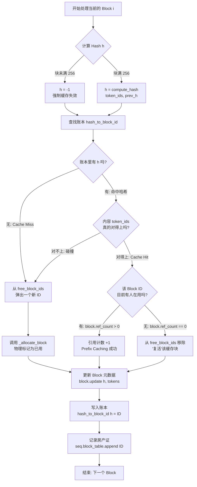

>项目连接: [nano-vllm](https://github.com/GeeeekExplorer/nano-vllm)
>参考文章：[2025最快下手vLLM的项目-nanovllm源码解读](https://zhuanlan.zhihu.com/p/1925484783229698084)

# 项目结构
```
nanovllm/
├── engine/                    #   推理引擎核心
│   ├── llm_engine.py         #   └── 总协调器，驱动整个推理流程
│   ├── scheduler.py          #   └── 智能调度器，决定执行顺序
│   ├── block_manager.py      #   └── KV缓存内存管理 (PagedAttention核心)
│   ├── model_runner.py       #   └── 单GPU上的模型执行器
│   └── sequence.py           #   └── 请求序列的数据结构
├── layers/                    # ⚙️ 神经网络层实现
│   ├── attention.py          #   └── FlashAttention + KV缓存管理
│   ├── sampler.py            #   └── 从logits采样生成token
│   ├── linear.py             #   └── 支持张量并行的线性层
│   ├── layernorm.py          #   └── RMS LayerNorm
│   ├── rotary_embedding.py   #   └── 旋转位置编码 (RoPE)
│   ├── activation.py         #   └── 激活函数 (SiLU)
│   └── embed_head.py         #   └── 词嵌入和语言模型头
├── models/                    #  ️ 具体模型架构
│   └── qwen3.py              #   └── Qwen3模型完整实现
├── utils/                     #   工具模块
│   ├── context.py            #   └── 全局上下文状态管理
│   └── loader.py             #   └── 模型权重加载器
├── config.py                 # ⚙️ 配置管理
├── llm.py                   #   用户接口入口
└── sampling_params.py       #   采样参数定义
```

# 整体架构图
```text
                          用户接口层
                        ┌─────────┐
                        │   LLM   │
                        └────┬────┘
                             │
                             ▼
                    ┌─────────────────┐
                    │   LLMEngine     │  ← 总指挥官
                    │                 │
                    │ ┌─────────────┐ │
                    │ │ Scheduler   │ │  ← 调度器
                    │ │ BlockManager│ │  ← 内存管家  
                    │ │ ModelRunner │ │  ← 执行引擎
                    │ └─────────────┘ │
                    └────────┬────────┘
                             │
                             ▼
                    ┌─────────────────┐
                    │ Model + Layers  │
                    │                 │
                    │ Qwen3Model      │  ← 模型主体
                    │ Attention       │  ← 注意力层
                    │ Sampler         │  ← 采样器
                    └─────────────────┘
```

# 关键数据流
## 数据流图
```text
用户输入 → Tokenizer → Sequence → Scheduler → ModelRunner → Model → Sampler → 输出

详细展开：
prompts     token_ids    Sequence     scheduled    input_ids    logits   token_ids    decoded_text
  ↓            ↓           ↓           seqs          ↓           ↓          ↓            ↓
"Hello"  →  [123,45]  →  Seq#1    →  [Seq#1]   →  tensor   →  tensor  →    67      →  " world"
"Hi"     →  [89,12]   →  Seq#2    →  [Seq#2]   →  [...]    →  [...]   →    23      →  " there"
```

## 数据结构转换过程
```text
# 1. 用户输入转换为Sequence对象
prompts = ["Hello", "How are you?"]
sampling_params = SamplingParams(temperature=0.8, max_tokens=50)

# 2. 每个prompt变成一个Sequence
sequences = []
for prompt in prompts:
    token_ids = tokenizer.encode(prompt)  # "Hello" → [123, 45, 67]
    seq = Sequence(token_ids, sampling_params)
    sequences.append(seq)

# 3. Scheduler决定哪些序列一起执行
scheduled_seqs, is_prefill = scheduler.schedule()
# 可能返回: ([seq1, seq2], True)  表示批量处理2个序列的prefill

# 4. ModelRunner准备模型输入
if is_prefill:
    input_ids, positions = prepare_prefill(scheduled_seqs)
    # input_ids: [123, 45, 67, 89, 12, 34]  # 拼接所有序列
    # positions: [0, 1, 2, 0, 1, 2]        # 每个token在序列中的位置
else:
    input_ids, positions = prepare_decode(scheduled_seqs)
    # input_ids: [67, 34]                   # 每个序列的最后一个token
    # positions: [3, 3]                    # 下一个位置（这里是为了指向计算出的新kv存储的位置，所以对于decode来说是下一个位置）

# 5. 模型计算得到logits
logits = model(input_ids, positions)
# logits shape: [batch_size, vocab_size]

# 6. Sampler生成下一个token
next_tokens = sampler(logits, temperatures)
# next_tokens: [89, 56]  # 为每个序列生成下一个token
```

# vLLM 工作流程

>以 bench.py 为例

### 初始化
-> `LLM()`  初始化一个 LLM 对象：
- 加载 config 配置
- 创建多个 `ModelRunner` 进程实现多线程（避免 Python 的GIL全局解释锁）
- 创建 `Scheduler` 管理器对象

具体而言
```python
def __init__(self, model, **kwargs):
	config_fields = {field.name for field in fields(Config)}
	config_kwargs = {k: v for k, v in kwargs.items() if k in config_fields}
	config = Config(model, **config_kwargs)
	self.ps = []
	self.events = []
	# CUDA 强制要求 -> spawn 启动方法会创建完全干净的新py解释器，确保每个进程能够独立、安全初始化CUDA环境
	ctx = mp.get_context("spawn")
	for i in range(1, config.tensor_parallel_size):
		event = ctx.Event() # 子进程同步事件对象
		process = ctx.Process(target=ModelRunner, args=(config, i, event)) # 创建子进程，target是进程启动后的类或函数
		process.start() # 启动子进程
		self.ps.append(process) # 方便后续的进程管理
		self.events.append(event) # 用于主进程和子进程间的通信
	self.model_runner = ModelRunner(config, 0, self.events)
	self.tokenizer = AutoTokenizer.from_pretrained(config.model, use_fast=True)
	config.eos = self.tokenizer.eos_token_id
	self.scheduler = Scheduler(config)
	atexit.register(self.exit)
```

关于 torch.multiprocessing 可以参考文章：[torch.multiprocessing](https://blog.csdn.net/weixin_42764932/article/details/132090185)

#### ModelRunner
```python
def __init__(self, config: Config, rank: int, event: Event | list[Event]):
	self.config = config
	hf_config = config.hf_config
	self.block_size = config.kvcache_block_size
	self.enforce_eager = config.enforce_eager
	self.world_size = config.tensor_parallel_size
	self.rank = rank
	self.event = event
	
	dist.init_process_group("nccl", "tcp://localhost:2333", world_size=self.world_size, rank=rank) # 分布式训练组
	torch.cuda.set_device(rank)
	default_dtype = torch.get_default_dtype()
	torch.set_default_dtype(hf_config.torch_dtype)
	torch.set_default_device("cuda")
	self.model = Qwen3ForCausalLM(hf_config) # 自己重新写的支持并行的 Qwen3ForCausalLM
	load_model(self.model, config.model)
	self.sampler = Sampler()
	self.warmup_model()
	self.allocate_kv_cache()
	if not self.enforce_eager:  # True 则走普通 torch 代码
		self.capture_cudagraph()
	torch.set_default_device("cpu")
	torch.set_default_dtype(default_dtype)
	
	if self.world_size > 1:
		if rank == 0:  # 主进程逻辑
			self.shm = SharedMemory(name="nanovllm", create=True, size=2**20)
			dist.barrier()  # 等待所有的分布式进程都到达 barrier，一种同步操作  
		else:
			dist.barrier()
			self.shm = SharedMemory(name="nanovllm")  # 连接主进程的 sharemem
			self.loop()
```

关于 ModelRunner 的初始化过程，可以看到
Runner 主要干三件事：
- 初始化子进程，初始化通信 group
- 读取模型，进行张量分割实现 tp 并行
- 预分配 kvcache，通过一次 warmup 来试探可以系统可以分配多少显存
#### Scheduler
然后就是 scheduler 调度器的初始化

```python
class Scheduler:
	def __init__(self, config: Config):
		self.max_num_seqs = config.max_num_seqs # 最长 decode 长度
		self.max_num_batched_tokens = config.max_num_batched_tokens # prefill 塞进去的最大长度
		self.eos = config.eos
		self.block_manager = BlockManager(config.num_kvcache_blocks, config.kvcache_block_size)
		# continues batching基础实现
		self.waiting: deque[Sequence] = deque()
		self.running: deque[Sequence] = deque()
```

##### Sequence
其中 Sequence 则是具体的请求序列
```python
class Sequence:
	block_size = 256
	counter = count() # 全局计数器, 数据实体，记录请求的状态

def __init__(self, token_ids: list[int], sampling_params = SamplingParams()):
	self.seq_id = next(Sequence.counter)
	self.status = SequenceStatus.WAITING
	self.token_ids = copy(token_ids)
	self.last_token = token_ids[-1]
	self.num_tokens = len(self.token_ids)
	self.num_prompt_tokens = len(token_ids) # sequence初始化记录 prompt 长度
	self.num_cached_tokens = 0 # prefix caching，prefill的前多少个词已经被算过了
	self.block_table = [] # 这个请求得到的 block
	self.temperature = sampling_params.temperature
	self.max_tokens = sampling_params.max_tokens
	self.ignore_eos = sampling_params.ignore_eos
```

## generate
经过初始化，generate 过程分两块
```python
llm.generate(["Benchmark: "], SamplingParams())
t = time.time()
llm.generate(prompt_token_ids, sampling_params, use_tqdm=True)
t = (time.time() - t)
```

其中第一次 generate 的作用是：
- torch 和 cuda 底层驱动的初始化
- PageAttention 的首轮物理分配（虽然初始化分配了显存，但 OS 和 GPU 驱动是“延迟分配”的，只有写入数据才会物理映射页面）
- Triton 内核与编译器冷启动



