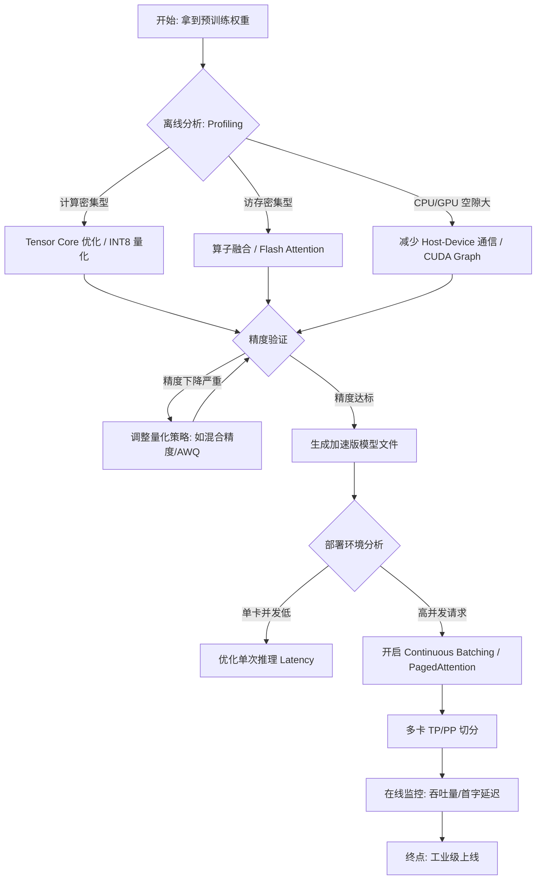

# 1. cu文件从编译到运行的具体过程？

编译过程
1. **NVCC 分离编译**：`nvcc` 会将代码拆分。Host 端代码（C++）交给 `g++` 或 `clang`，Device 端代码（`__global__` 函数）由 NVIDIA 编译器处理
2. **PTX 到 SASS**：
	- PTX (Parallel Thread Execution)：一种虚拟指令集，类似于汇编，保证了跨代 GPU 的兼容性
	- SASS (Streaming Assembler)：这是真正跑在硬件上的机器码

运行阶段
假设启动了 `gemm_v3<<<grid, block>>>`，矩阵大小为 $128 \times 128$，`BM=128, BN=128, BK=16`，`block(16, 16)`。
1. Grid 与 Block 的分配：
    - 逻辑层：你定义了一个 `grid`。GPU 的 GigaThread Engine 接收到任务，将这些 `block` 分发给不同的 SM。
    - **硬件层**：一个 SM 会承载一个或多个 `block`（取决于资源占用）。在你的 `gemm_v3` 中，每个线程块需要大量的 `shared memory` (约 $128 \times 16 \times 4 \times 2 = 16KB$) 和寄存器。如果 SM 资源够，它可能同时跑 2 个 block。
2. Warp 的分束 (The Warp Level)：
    - 硬件会将 `block` 里的 256 个线程（16x16）拆分成 8 个 **Warp**（每个 Warp 32 线程）。
    - **重点**：SM 中的 Warp Scheduler 负责调度。在一个时钟周期内，调度器选出一个“准备好”的 Warp，将其指令发射到执行单元（如 CUDA Core）。
3. SIMT 执行：
    - 当执行 `r_c[i][j] += r_a[i] * r_b[j]` 时，Warp 里的 32 个线程同时执行这条指令，但操作不同的寄存器数据。这就是 SIMT (Single Instruction, Multiple Threads)。

| **层级**            | **操作主体**             | **单位**    | **关键点**            |
| ----------------- | -------------------- | --------- | ------------------ |
| **发射 (Launch)**   | CPU (Driver)         | **Grid**  | 整个任务的边界            |
| **调度 (Schedule)** | GPU Global Scheduler | **Block** | 决定哪个 SM 负责哪个块      |
| **执行 (Execute)**  | SM Warp Scheduler    | **Warp**  | 真正占用 CUDA Core 的瞬间 |

# 2. 超参数如何设置？（以GridDim和BlockDim为例）

GridDim、BlockDim的设计原则：
1. warp 对齐（32倍数），如果 block 开的是（10，10），那么需要 10 \* 10 / 32 = 3 ... 4，向上取整需要四个 warp，结果浪费了 32 - 4=28个线程资源
2. Occupancy：
	1. SM中寄存器数量是固定的，比如 A100 是 64K 个 32-bit 寄存器，如果线程开太多寄存器那么并行的 warp 会被压缩
	2. share mem同理，如果 block 的share mem 开太大，那么 SM 中的block会变少
3. 访存合并：
	1. `threadIdx.x` 应该对应最内层（连续）的维度。在 `gemm` 中，`col = blockIdx.x * TILE_SIZE + threadIdx.x`。这样当一个 Warp 的 32 个线程读取 `b` 时，地址是连续的，一次 DRAM 请求就能取回所有数据。
4. 经验值：
	1. 推理场景 block 大小为 128 或 256
	2.  grid 大小应该远大于 SM 数量，保证硬件始终有活干

# 3. GPU 硬件架构？

| **名词**                | **物理位置**          | **对应 CPU 概念** | **作用与特点**                                                                       |
| --------------------- | ----------------- | ------------- | ------------------------------------------------------------------------------- |
| **Registers (寄存器)**   | 每个 SM 内部          | 通用寄存器         | **最快**。线程私有，容量极小（几百KB/SM）。线程中私有变量就在这里。                                          |
| **SRAM (Static RAM)** | SM 内部 (L1/Shared) | L1 Cache      | 用于 **L1 缓存** 和 **Shared Memory**。延迟极低。                                          |
| **L1 Cache**          | 每个 SM 内部          | L1 Cache      | 自动缓存全局内存访问。在现代 GPU 中，L1 和 Shared Mem 共享物理 SRAM。                                 |
| **L2 Cache**          | 所有 SM 共享          | L3 Cache      | 跨 SM 的数据交换中心。比 HBM 快，但比 L1 慢。                                                   |
| **显存 (DRAM/HBM)**     | GPU 芯片旁边 (PCB板上)  | 内存 (DDR4/5)   | **HBM (High Bandwidth Memory)** 是现代推理显卡的标准（如 A100/H100）。通过硅通孔技术堆叠，提供数 TB/s 的带宽。 |

# 4. Tensor Core初步了解？

如何调用？使用 `nvcuda::wmma` 
与 CUDA Core 的区别：
- CUDA Core 是标量/矢量单元。一个指令算一次 `a * b + c` (FMA)。
- Tensor Core 是矩阵单元。一个指令直接完成两个矩阵（如 4x4 或 16x16）的相乘累加。它的吞吐量通常是 CUDA Core 的 **8~16 倍**。

**它在哪里？**
- 它集成在 **SM 内部**。一个 SM 通常包含 4 个处理块（Processing Blocks），每个块里有若干 CUDA Core 和少数几个 Tensor Core。

**数据流动区别**：
- 普通算子：寄存器 $\rightarrow$ CUDA Core $\rightarrow$ 寄存器。
- Tensor Core：它通常直接从 **Shared Memory 或特定的寄存器组 (Fragments)** 读取数据。在 `gemm_v5` 中定义的 `a_frag` 实际上就是一种特殊的寄存器映射，专门为了喂给 Tensor Core。

# 5. 模型离线 Profile 方法论？

# 6. 如何判断计算密集/访存密集？

## roofline model

### 计算强度

计算该算子的**计算强度 $I$**。其定义为：

$$I = \frac{\text{计算量 (Floating-point Operations)}}{\text{访存量 (Bytes Memory Traffic)}}$$

单位通常是 `FLOPs/Byte`。
- **计算量 (Operations)**：算子执行的总浮点运算次数（乘法、加法、指数等）。
- **访存量 (Traffic)**：算子从显存（DRAM/HBM）读取和写入的总数据量。注意：**不是**指程序里定义的变量大小，而是实际发生的总线数据交换量。

### 计算访存比

你需要查询你所使用的 GPU 的两个关键参数：
1. **峰值性能 ($P_{\text{peak}}$)**：单位 `TFLOPS` (每秒万亿次浮点运算)。
2. **显存带宽 ($B_{\text{peak}}$)**：单位 `GB/s` (每秒传输字节数)。

**硬件转折点 ($I_{\text{threshold}}$)**：

$$I_{\text{threshold}} = \frac{P_{\text{peak}}}{B_{\text{peak}}}$$

- **如果 $I > I_{\text{threshold}}$**：该算子理论上受限于计算能力，是**计算密集型**。
- **如果 $I < I_{\text{threshold}}$**：该算子理论上受限于显存带宽，是**访存密集型**。

